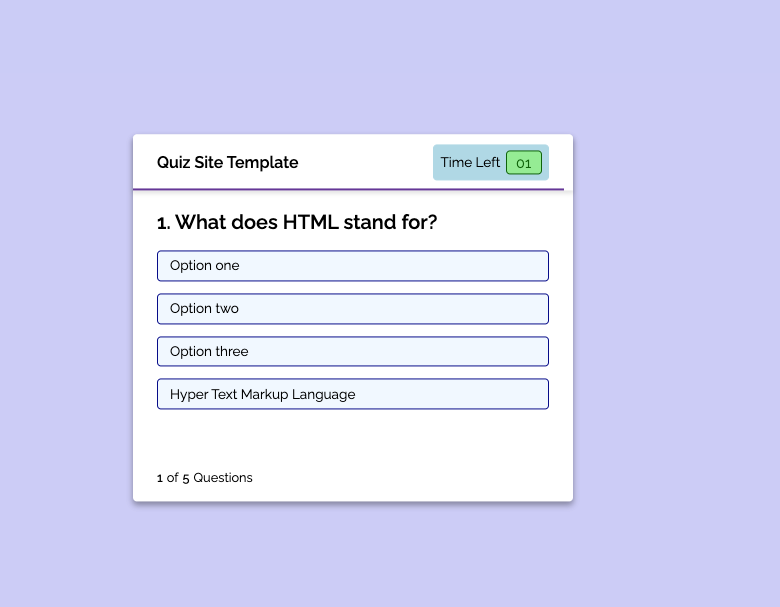

# Quiz-Site-Template-CNR

## Description

My goal was to create a quiz template that users could easily update with their own questions and time frame.
This site allows users to take a quiz within a given time limit and record their score upon completion.

## Usage

Users can start the quiz and read the terms of the quiz. Once they begin the quiz the timer will start and they will have the option to select an answer for each question. Once the quiz has been completed the user can record their information, end the quiz, or retake the quiz.

## Credits

CSS tutorials from W3Schools https://my-learning.w3schools.com/tutorial/css

HTML tutorials from W3Schools https://my-learning.w3schools.com/tutorial/html

Quiz Template Tutorial A :  part one https://www.youtube.com/watch?v=pQr4O1OITJo

                            part two - https://www.youtube.com/watch?v=WUBhpSRS_fk

Quiz Template Tutorial B : https://www.youtube.com/watch?v=riDzcEQbX6k

## Screenshot

 
## License

MIT License

Copyright (c) [2022] [Connor Banks Tamminen]

Permission is hereby granted, free of charge, to any person obtaining a copy
of this software and associated documentation files (the "Software"), to deal
in the Software without restriction, including without limitation the rights
to use, copy, modify, merge, publish, distribute, sublicense, and/or sell
copies of the Software, and to permit persons to whom the Software is
furnished to do so, subject to the following conditions:

The above copyright notice and this permission notice shall be included in all
copies or substantial portions of the Software.

THE SOFTWARE IS PROVIDED "AS IS", WITHOUT WARRANTY OF ANY KIND, EXPRESS OR
IMPLIED, INCLUDING BUT NOT LIMITED TO THE WARRANTIES OF MERCHANTABILITY,
FITNESS FOR A PARTICULAR PURPOSE AND NONINFRINGEMENT. IN NO EVENT SHALL THE
AUTHORS OR COPYRIGHT HOLDERS BE LIABLE FOR ANY CLAIM, DAMAGES OR OTHER
LIABILITY, WHETHER IN AN ACTION OF CONTRACT, TORT OR OTHERWISE, ARISING FROM,
OUT OF OR IN CONNECTION WITH THE SOFTWARE OR THE USE OR OTHER DEALINGS IN THE
SOFTWARE.

